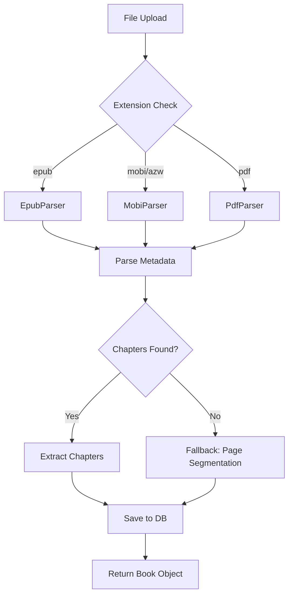

# MOBI és PDF Formátum Támogatás Tervezés

## Áttekintés

Dokumentum a MOBI és PDF e-könyv formátumok támogatásának bővítéséről az EPUB mellett.

---

## Jelenlegi Állapot

A rendszer jelenleg **kizárólag EPUB formátumot** támogat:

- Parser: `backend/app/services/epub_parser.py`
- Router: `backend/app/routers/books.py` (csak `.epub` kiterjesztést fogad el)
- Frontend: `frontend/src/components/FileUpload.tsx` (csak EPUB fájlokat enged)
- Könyvtár: `ebooklib` + `BeautifulSoup`

---

## Bonyolultsági Elemzés

### MOBI/AZW3

| Szempont | Értékelés |
|----------|-----------|
| Bonyolultság | Alacsony-közepes |
| Hasonlóság EPUB-hoz | Magas |
| Metaadat támogatás | Jó |
| Fejezetszerkezet | Van (de egyszerűbb) |

**Fő kihívások:**
- Kevesebb metaadat mint EPUB-ban
- Különböző MOBI verziók (MOBI7, MOBI8/KF8)
- Calibre DRM-es könyvek kezelése (szükség esetén figyelmeztetés)

### PDF

| Szempont | Értékelés |
|----------|-----------|
| Bonyolultság | Közepes |
| Hasonlóság EPUB-hoz | Alacsony |
| Metaadat támogatás | Korlátozott |
| Fejezetszerkezet | Nincs beépítve |

**Fő kihívások:**
- PDF-ben nincs explicit fejezetszerkezet
- Szöveg kinyerése függ az OCR-től (szkennelt PDF-eknél)
- Fejezetdetektáláshoz heurisztika szükséges

---

## Javasolt Könyvtárak

### PDF Kezelés

| Könyvtár | Előnyök | Hátrányok |
|----------|---------|-----------|
| **pymupdf (fitz)** | Gyors, jó szövegkinyerés, metaadat | Licenc figyelés (AGPL/commercial) |
| pdfplumber | Táblázatokhoz jó, Pythonic | Lassabb nagy fájloknál |
| PyPDF2 | Könnyű, tiszta licenc | Korlátozott funkcionalitás |

**Javaslat:** `pymupdf` a sebesség és minőség miatt

### MOBI Kezelés

| Könyvtár | Leírás |
|----------|--------|
| `mobi` | Egyszerű MOBI olvasó Pythonban |
| `kindleunpack` | Calibre eszköz Python wrapperrel |

**Javaslat:** `mobi` könyvtár egyszerűsége miatt

---

## Architektúra Terv

### Unified Parser Interfész

```python
# backend/app/services/book_parser.py
from abc import ABC, abstractmethod
from pathlib import Path
from typing import Dict, List, Any

class BookParser(ABC):
    @abstractmethod
    def parse(self, file_path: Path) -> Dict[str, Any]:
        """Parse book and return structured data."""
        pass
    
    @abstractmethod
    def can_parse(self, file_path: Path) -> bool:
        """Check if this parser can handle the file."""
        pass

class ParsedBook:
    title: str
    author: str
    language: str
    chapters: List[Chapter]
    
class Chapter:
    chapter_number: int
    title: str
    text: str
    word_count: int
```

### Parser Registry Pattern

```python
class ParserRegistry:
    _parsers: List[BookParser] = []
    
    @classmethod
    def register(cls, parser: BookParser):
        cls._parsers.append(parser)
    
    @classmethod
    def get_parser(cls, file_path: Path) -> BookParser:
        for parser in cls._parsers:
            if parser.can_parse(file_path):
                return parser
        raise UnsupportedFormatError(f"No parser found for {file_path}")
```

---

## PDF Fejezetezési Stratégiák

### 1. Betűméret Alapján

```python
def detect_chapters_by_font_size(blocks):
    """Larger font sizes indicate chapter titles."""
    font_sizes = [block['size'] for block in blocks]
    threshold = max(font_sizes) * 0.8
    
    chapters = []
    current_chapter = []
    
    for block in blocks:
        if block['size'] >= threshold:
            if current_chapter:
                chapters.append(current_chapter)
            current_chapter = [block]
        else:
            current_chapter.append(block)
    
    return chapters
```

### 2. Félkövér Formázás Alapján

```python
def detect_chapters_by_bold(blocks):
    """Bold text often indicates headings."""
    for block in blocks:
        if block.get('flags', 0) & 2 ** 4:  # Bold flag
            # Potential chapter start
            pass
```

### 3. Egyszerű Szegmentálás (Fallback)

```python
def simple_page_segmentation(pdf_path, pages_per_chapter=10):
    """Create chapters every N pages as fallback."""
    chapters = []
    for i in range(0, total_pages, pages_per_chapter):
        chapter_text = extract_text_from_pages(i, i + pages_per_chapter)
        chapters.append({
            'title': f'Chapter {len(chapters) + 1}',
            'text': chapter_text
        })
    return chapters
```

**Javasolt sorrend:**
1. Próbáljuk a betűméret alapján
2. Ha nem működik, félkövér alapján
3. Végül egyszerű oldalszám alapú szegmentálás

---

## Implementációs Lépések

### 1. Függőségek Hozzáadása

```txt
# backend/requirements.txt
# Existing...
ebooklib>=0.18
beautifulsoup4>=4.12.0

# New dependencies
pymupdf>=1.23.0  # PDF handling
mobi>=0.3.0      # MOBI handling
python-magic>=0.4.27  # File type detection
```

### 2. Parser Modulok Létrehozása

```
backend/app/services/
├── __init__.py
├── book_parser.py      # Unified interface
├── epub_parser.py      # Refactored existing
├── mobi_parser.py      # New
├── pdf_parser.py       # New
└── parser_registry.py  # Registry pattern
```

### 3. EPUB Parser Refaktorálás

A meglévő `epub_parser.py` átalakítása az új interfészre:

```python
from .book_parser import BookParser, ParsedBook

class EpubParser(BookParser):
    def can_parse(self, file_path: Path) -> bool:
        return file_path.suffix.lower() == '.epub'
    
    def parse(self, file_path: Path) -> ParsedBook:
        # Existing logic refactored
        ...
```

### 4. MOBI Parser Implementálás

```python
class MobiParser(BookParser):
    def can_parse(self, file_path: Path) -> bool:
        return file_path.suffix.lower() in ['.mobi', '.azw', '.azw3']
    
    def parse(self, file_path: Path) -> ParsedBook:
        # Use mobi library
        book = mobi.read(str(file_path))
        # Extract metadata
        # Extract chapters (simpler than EPUB)
        ...
```

### 5. PDF Parser Implementálás

```python
class PdfParser(BookParser):
    def can_parse(self, file_path: Path) -> bool:
        return file_path.suffix.lower() == '.pdf'
    
    def parse(self, file_path: Path) -> ParsedBook:
        doc = fitz.open(str(file_path))
        
        # Extract metadata
        title = doc.metadata.get('title', 'Unknown Title')
        author = doc.metadata.get('author', 'Unknown')
        
        # Extract text blocks with font info
        blocks = self._extract_blocks(doc)
        
        # Detect chapters using heuristics
        chapters = self._detect_chapters(blocks)
        
        return ParsedBook(...)
```

### 6. Router Frissítés

```python
# backend/app/routers/books.py
from app.services.parser_registry import ParserRegistry

SUPPORTED_EXTENSIONS = ['.epub', '.mobi', '.azw', '.azw3', '.pdf']

@router.post("/upload", response_model=BookOut, status_code=201)
async def upload_book(file: UploadFile = File(...), db: AsyncSession = Depends(get_db)):
    # Validate extension
    ext = Path(file.filename).suffix.lower()
    if ext not in SUPPORTED_EXTENSIONS:
        raise HTTPException(400, f"Supported formats: {', '.join(SUPPORTED_EXTENSIONS)}")
    
    # Save file
    file_path = settings.books_path / file.filename
    with open(file_path, "wb") as f:
        shutil.copyfileobj(file.file, f)
    
    # Get appropriate parser
    parser = ParserRegistry.get_parser(file_path)
    parsed = parser.parse(file_path)
    
    # Rest remains same...
```

### 7. Frontend Frissítés

```tsx
// frontend/src/components/FileUpload.tsx
const SUPPORTED_FORMATS = ['.epub', '.mobi', '.azw', '.azw3', '.pdf'];

export default function FileUpload({ onUpload }: { onUpload: (book: Book) => void }) {
    const handleFile = useCallback(async (file: File) => {
        const ext = file.name.toLowerCase();
        const isValid = SUPPORTED_FORMATS.some(fmt => ext.endsWith(fmt));
        
        if (!isValid) {
            alert(`Supported formats: ${SUPPORTED_FORMATS.join(', ')}`);
            return;
        }
        // ...
    }, [onUpload]);
    
    return (
        <input
            type="file"
            accept=".epub,.mobi,.azw,.azw3,.pdf"
            // ...
        />
    );
}
```

---

## Mermaid Diagram



---

## Tesztelési Stratégia

### Unit Tesztek

```python
# backend/tests/test_parsers.py
class TestEpubParser:
    def test_parse_valid_epub(self):
        parser = EpubParser()
        result = parser.parse("test.epub")
        assert result.title is not None
        assert len(result.chapters) > 0

class TestMobiParser:
    def test_parse_valid_mobi(self):
        parser = MobiParser()
        result = parser.parse("test.mobi")
        # Assertions...

class TestPdfParser:
    def test_detect_chapters_by_font_size(self):
        parser = PdfParser()
        blocks = [
            {'text': 'Chapter 1', 'size': 24},
            {'text': 'Content...', 'size': 12},
        ]
        chapters = parser._detect_chapters(blocks)
        assert len(chapters) == 1
```

### Integrációs Tesztek

- Feltöltés minden formátummal
- Hibakezelés korrupt fájloknál
- Nagy fájlok (>50MB) kezelése

---

## Kockázatok és Megoldások

| Kockázat | Valószínűség | Hatás | Megoldás |
|----------|--------------|-------|----------|
| DRM-es könyvek | Közepes | Magas | Felhasználói figyelmeztetés |
| Szkennelt PDF | Közepes | Közepes | OCR nem támogatott - jelezni kell |
| Nagy fájlok | Alacsony | Közepes | Streaming parser, chunk-olás |
| Rosszul formázott MOBI | Közepes | Alacsony | Try-catch, fallback logika |

---

## Alternatívák

### Opció A: Külső Szolgáltatás Használata

- Calibre Web API
- Google Books API
- **Hátrány:** Függőség, költség, adatvédelem

### Opció B: Calibre Parancssori Eszközök

- `ebook-convert` használata minden formátum EPUB-ra alakítására
- **Előny:** Egyetlen parser kell
- **Hátrány:** Calibre telepítése szükséges, lassabb

**Javaslat:** A natív parser implementáció (Opció C) a legjobb egyensúly.

---

## Következő Lépések

1. Elfogadásra vár a terv
2. Implementálás Code módban
3. Tesztelés minta fájlokkal
4. Dokumentáció frissítése

---

*Dátum: 2026-03-06*
